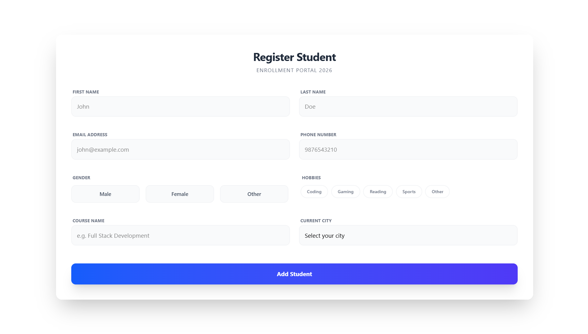
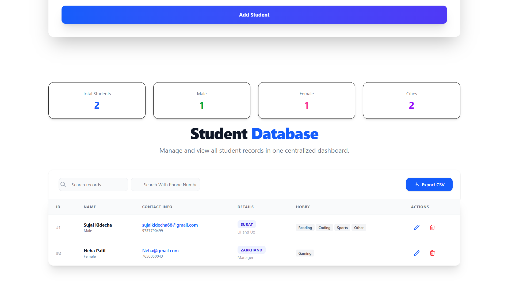

# 🎓 Student Enrollment CRUD App

A full-featured **Student Management System** built with **React + TypeScript + Vite + Tailwind CSS**. Add, update, delete, and search student records — all stored in `localStorage`.

---

## 🚀 Tech Stack

| Technology | Version |
|---|---|
| React | 19.x |
| TypeScript | 5.9.x |
| Vite | 7.x |
| Tailwind CSS | 4.x |
| React Toastify | 11.x |

---

## ✨ Features

- ✅ **Add Student** — Register students with full details
- ✏️ **Update Student** — Edit existing student records inline
- 🗑️ **Delete Student** — Remove records with toast notification
- 🔍 **Search** — Filter by name, email, city or phone number
- 📊 **Live Stats** — Total students, male/female count, unique cities
- 💾 **LocalStorage** — Data persists on page refresh
- 📱 **Responsive** — Works on mobile, tablet & desktop

---

## 📸 Screenshots

### 📝 Registration Form


### 📋 Student Table


---

## 🗂️ Project Structure

```
src/
├── assets/
│   ├── form.png          # Form screenshot
│   └── table.png         # Table screenshot
├── components/
│   ├── Form.tsx          # Student registration & update form
│   └── Table.tsx         # Student data table with search & stats
├── utils/
│   └── global.ts         # Shared TypeScript types
├── App.tsx               # Root component — state management
└── main.tsx              # Entry point
```

---

## 🧾 Student Fields

| Field | Type | Validation |
|---|---|---|
| First Name | Text | Required |
| Last Name | Text | Required |
| Email | Email | Required, valid format |
| Phone | Number | Required, 10-digit Indian number |
| Gender | Radio | Required (Male / Female / Other) |
| Hobbies | Checkbox | At least one required |
| Course | Text | Required |
| City | Dropdown | Required |

---

## ⚡ Getting Started

```bash
# Install dependencies
npm install

# Start dev server
npm run dev

# Build for production
npm run build
```

---

## 👨‍💻 Author

Made with ❤️ using React + TypeScript
